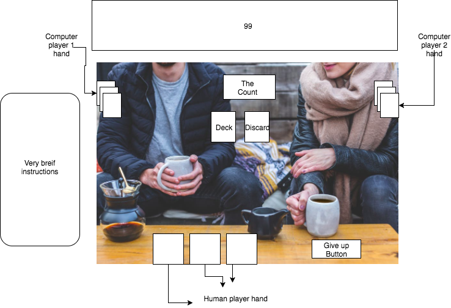

## 99_CountingGame

### Background

99 is a nearly lost card game my dad's godmother learned from gypsies is Norway. It has been
a family road trip favorite for ever since I was a child. I want to preserve and immortalize this game, for which I have found no other computer games made. It uses a standard Anglo-American playing card deck .  The game is played  as follows:

1) players are dealt a hand of 3 cards
2) They take turns playing a card, adding the total value of the card to a running total count and drawing a new card
3) You lose if you cannot play a card that would make the total less than 100
4) there are 4 magic cards
  -[ ] 4: value is 0 and play order is reversed
  -[ ] 9: value is 0, AKA PASS
  -[ ] 10: subtracts 10 from the Count
  -[ ] J: Sets the count to 99  

There are some variations on the way 99 is played.  But this is how my family plays so it is the one true way to play the game.  

### Functionality & MVP  

The game of 99 will require :

  -[ ] Human Player can receive cards in there hand, play them and the count will increase
  -[ ] Artificial Intelligence makes smart plays
  -[ ] Game logic tracks turns and keeps the game running 
  -[ ] game will keep a running score of multiple games

In addition, this project will include:

- [ ] A production Readme

### Wireframes

This game will be a single screen.  It will render a hand of visible cards for the Human player as a well as 2
facedown hands for the Computer Players. Cards will travel from too and from the discard pile as well from the deck.
Computer players will slightly light up when it is their turn and grey out if they get defeated. We will also render a
give up button.  The remaining surviving player should mock the player for losing before the game gets reset.

Magic cards will not be explained in the rules but will give brief explanation on the card itself

### Architecture and Technologies

This project will be implemented with the following technologies:

- Vanilla JavaScript and `jquery` for overall structure and game logic,
- `Easel.js` with `HTML5 Canvas` for DOM manipulation and rendering,
- Webpack to bundle and serve up the various scripts.

In addition to the webpack entry file, there will be three scripts involved in this project:

`view.js`: this script will handle the logic for creating and updating the necessary `Easel.js` elements and rendering them to the DOM.

`game.js`: this script will handle the logic behind the scenes.

### Implementation Timeline

**Day 1**: write the bulk of underlining logic and set up environment

  Create `webpack.config.js` as well as `package.json`.  Write a basic entry file.

  Write the Game, Player, and Card Logic

- Write the basic game logic
- Learn enough `Easel.js` to render an object to the `Canvas` element

**Day 2**: Finish up the underlining game logic and  Learn to use Easel

Dedicate this day to learning the `Easel.js` API.  Card object to connect to the `game` object.  Then, use `board.js` to create and render at least the hand .  Build in the ability to toggle the face up/ facedown states o  Goals for the day:

- Render a square grid to the `Canvas` using `Easel.js`
- Render sweet background with players
- get cards to render on the screen
- some basic animation with cards moving around

**Day 3**: Get to UI elements to a working level and install the user controls

- Play a card
- give up buttons
- background players
- Instructions

**Day 4**: Style the frontend, making it polished and professional.

- Have a styled `Canvas`, nice looking controls and title
- Smooth out the animation on the cards, add visual effects to the robot players

### Bonus features

There are many directions this cellular automata engine could eventually go.  Some anticipated updates are:

- [ ] Fire works if you win/ slime if you loose?
- [ ] Glowy effects on magic cards
- [ ] Computer players express displeasure when losing
- [ ] Computer players gloats when they win   
- [ ] Cards that cant be played get greyed out
- [ ] Different computer players (difficulty/personality)
- [ ] Different backgrounds
- [ ] New (not regulation) magic cards
- [ ] A model with game rules
